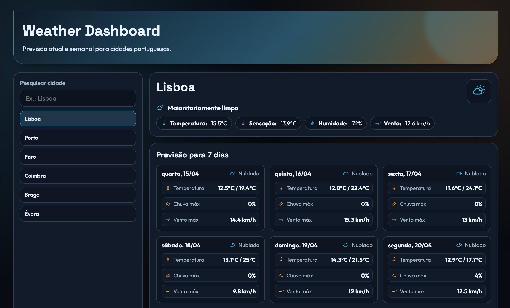

# Tutorial passo a passo - Weather Dashboard (Ficha React 12.º ano)

Este tutorial explica, do início ao fim, como construir a app **weather-dashboard**.
É uma ficha pensada para consolidar os seguintes temas de React:

1. Fundamentos e setup
2. JSX e componentes
3. Props e composição
4. Estado e eventos
5. Listas e condicionais
6. Formulários controlados
7. Assíncrono
8. useEffect e dados externos

---

## 0) O que vais construir



Uma app de meteorologia com dados reais da **Open-Meteo**:

- Lista fixa de cidades portuguesas (Lisboa, Porto, Faro, Coimbra, Braga, Évora)
- Pesquisa por nome (input controlado)
- Seleção de cidade para ver o tempo atual
- Previsão para 7 dias (listas com `map`)
- Painel de comparação de 3 cidades
- Estados de loading, erro e “sem resultados” (renderização condicional)

**Vocabulário rápido**

- **Página (Page)**: componente que representa um “ecrã” da app.
- **Componente (Component)**: peça reutilizável de UI.
- **Estado (State)**: dados que mudam e fazem a UI re-renderizar.
- **API**: serviço externo que devolve dados (neste caso, meteorologia).

**Debug rápido para toda a ficha**

1. Terminal está na pasta certa? (`pwd`)
2. App está a correr? (`npm run dev`)
3. Console do browser mostra erros?
4. Network mostra pedidos ao carregar?
5. Imports/paths estão corretos?

**Pontos de paragem**

- **Paragem A**: depois de renderizar a lista de cidades com dados locais.
- **Paragem B**: depois da pesquisa e da seleção funcionarem.
- **Paragem C**: depois do fetch da Open-Meteo com loading/erro.
- **Paragem D**: depois da previsão de 7 dias aparecer corretamente.
- **Paragem E**: depois do painel de comparação de 3 cidades com `useMemo`.

**Mapa mental da app**

- Fontes de dados: **cities.js (local)** + **Open-Meteo API**
- Estados chave: `selectedCityId`, `query`, `weatherByCity`, `mainLoading`, `mainError`, `comparisonLoading`, `comparisonError`, `compareCityIds`
- Regras de render: estado principal e estado da comparação são tratados separadamente
- O que dispara re-render: **qualquer `setState`**

### 0.1) Ligações diretas aos 8 temas

1. **Fundamentos e setup** - Vite, estrutura base do projeto, `index.html`, `main.jsx`.
2. **JSX e componentes** - dividir UI em componentes pequenos.
3. **Props e composição** - passar dados/handlers do `App` para componentes.
4. **Estado e eventos** - `useState`, cliques, seleção, inputs.
5. **Listas e condicionais** - `map`, `filter`, `&&`, ternários, estados vazios.
6. **Formulários controlados** - input de pesquisa com `value` e `onChange`.
7. **Assíncrono** - `fetch`, `async/await`, `Promise.all`.
8. **useEffect e dados externos** - carregar da API e reagir à mudança de cidade.

### 0.2) Mapa de fases

Se te perderes, volta aqui. Cada fase termina com checkpoint.

- Fase 1 - App mínima (renderização): `src/App.jsx`
- Fase 2 - Layout + estados base (SearchCity/CityList): `src/App.jsx`, `src/components/SearchCity.jsx`, `src/components/CityList.jsx`
- Fase 3 - Dados externos + loading/erro (Open-Meteo): `src/services/weatherApi.js`, `src/App.jsx`, `src/components/LoadingState.jsx`, `src/components/ErrorState.jsx`, `src/components/WeatherCard.jsx`, `src/components/ForecastList.jsx`
- Fase 4 - Comparação de 3 cidades com `useMemo`: `src/App.jsx`, `src/components/ComparePanel.jsx`
- Fase 5 - Versão final com validações e polimento: `src/App.jsx`

### 0.3) Conceitos essenciais

Esta secção serve para criares uma base mental sólida antes de escrever código.  
Se estes conceitos estiverem claros, a ficha torna-se muito mais fácil de seguir.

**1) Fluxo da app (dados e interface)**

- A interface (UI) mostra sempre o estado atual do React.
- Quando o estado muda (`setState`), o React volta a desenhar a UI.
- Nesta ficha, o estado principal vive no `App.jsx` e é distribuído por props para os componentes filhos.

**2) Estado local vs dados externos**

- `query`, `selectedCityId`, `mainLoading`, `mainError`, `compareCityIds` são estados locais da aplicação.
- Dados meteorológicos vêm de uma API externa (Open‑Meteo), por isso podem demorar, falhar ou vir incompletos.
- Por isso usamos três estados lógicos para dados externos: `loading`, `error`, `success`.

**3) Renderização condicional**

- A UI não deve tentar mostrar dados que ainda não existem.
- Regra prática: primeiro validar `loading` e `error`, só depois renderizar componentes que dependem de dados.
- Isto evita erros do tipo “cannot read property of undefined”.

**4) Unidirecionalidade de dados em React**

- O dado “desce” por props: `App` -> componentes filhos.
- As ações “sobem” por callbacks: filho chama função recebida por props e o pai atualiza estado.
- Exemplo: `CityList` não escolhe a cidade sozinho; chama `onSelectCity`, e `App` decide o novo estado.

**5) Inputs controlados**

- Um input controlado tem o seu valor ligado ao estado React.
- `value` mostra o estado atual, `onChange` atualiza esse estado.
- Vantagem: pesquisa, validação e regras da UI ficam previsíveis.

**6) Listas, keys e identidade**

- Sempre que usares `map`, cada item precisa de `key` estável.
- Nesta ficha, usamos `city.id` e `day.date` porque representam identidade real do elemento.
- Keys corretas ajudam o React a atualizar só o que mudou.

**7) Efeitos e assíncrono**

- `useEffect` corre efeitos colaterais (ex.: chamar API) após o render.
- Dependências do `useEffect` controlam quando o efeito volta a correr.
- `fetch` é assíncrono: usas `async/await`, `try/catch` e verificas `response.ok`.

**8) Separação de responsabilidades**

- `services/weatherApi.js`: lógica de pedidos e transformação de dados da API.
- `components/*.jsx`: apenas apresentação e interação.
- `App.jsx`: orquestra estados, efeitos e composição da página.

**9) Normalização de texto (acentos)**

- Para pesquisa pedagógica e robusta, normalizamos texto (`Évora` e `evora` devem funcionar).
- Isto introduz uma prática importante de UX e internacionalização logo no nível base.

**Erros comuns cedo**

- Import com caminho errado
- `useEffect` sem dependências corretas
- Misturar loading principal com loading da comparação
- `fetch` sem verificar `response.ok`
- Pesquisa sem normalização de acentos (`Évora` vs `evora`)
- Tentar usar dados da API antes de existirem
- Esquecer `key` nas listas

---

## 1) Pré‑requisitos

- Node.js (18 ou superior)
- npm (vem com o Node)
- VS Code (ou outro editor)
- Terminal aberto numa pasta onde tenhas permissões para criar projetos

Verifica versões:

```bash
# Objetivo: executar este comando no terminal para preparar ou correr o projeto.
# Verifica a pasta atual antes de correr (pwd) para evitar criar ficheiros no local errado.
# Depois confirma o resultado esperado no terminal antes de avançar para o próximo passo.
node -v
npm -v
```

---

## 2) Criar o projeto com Vite

1. Criar o projeto:

```bash
# Objetivo: executar este comando no terminal para preparar ou correr o projeto.
# Verifica a pasta atual antes de correr (pwd) para evitar criar ficheiros no local errado.
# Depois confirma o resultado esperado no terminal antes de avançar para o próximo passo.
npm create vite@latest weather-dashboard -- --template react
```

2. Entrar na pasta:

```bash
# Objetivo: executar este comando no terminal para preparar ou correr o projeto.
# Verifica a pasta atual antes de correr (pwd) para evitar criar ficheiros no local errado.
# Depois confirma o resultado esperado no terminal antes de avançar para o próximo passo.
cd weather-dashboard
```

3. Instalar dependências:

```bash
# Objetivo: executar este comando no terminal para preparar ou correr o projeto.
# Verifica a pasta atual antes de correr (pwd) para evitar criar ficheiros no local errado.
# Depois confirma o resultado esperado no terminal antes de avançar para o próximo passo.
npm install
```

3.1. Instalar biblioteca de ícones:

```bash
# Objetivo: executar este comando no terminal para preparar ou correr o projeto.
# Verifica a pasta atual antes de correr (pwd) para evitar criar ficheiros no local errado.
# Depois confirma o resultado esperado no terminal antes de avançar para o próximo passo.
npm install react-icons
```

4. Abrir no VS Code:

```bash
# Objetivo: executar este comando no terminal para preparar ou correr o projeto.
# Verifica a pasta atual antes de correr (pwd) para evitar criar ficheiros no local errado.
# Depois confirma o resultado esperado no terminal antes de avançar para o próximo passo.
code .
```

---

## 3) Limpeza inicial

O Vite cria ficheiros de exemplo. Vamos deixar o projeto limpo.

- Apaga `src/App.css` (não vamos usar).
- Remove o import `./App.css` do `App.jsx` (se existir).
- Apaga `src/assets/`, se existir.

No fim, deves ter no mínimo:

```
src/
  App.jsx
  main.jsx
```

---

## 5) Estrutura de pastas da ficha

Vamos organizar assim:

```
weather-dashboard/
├─ index.html
├─ package.json
└─ src/
   ├─ main.jsx
   ├─ App.jsx
   ├─ data/
   │  └─ cities.js
   ├─ components/
   │  ├─ ComparePanel.jsx
   │  ├─ CityList.jsx
   │  ├─ ErrorState.jsx
   │  ├─ ForecastList.jsx
   │  ├─ LoadingState.jsx
   │  ├─ SearchCity.jsx
   │  └─ WeatherCard.jsx
   ├─ services/
   │  └─ weatherApi.js
   └─ styles/
      ├─ index.css
      └─ weather.css
```

Cria as pastas:

```bash
# Objetivo: executar este comando no terminal para preparar ou correr o projeto.
# Verifica a pasta atual antes de correr (pwd) para evitar criar ficheiros no local errado.
# Depois confirma o resultado esperado no terminal antes de avançar para o próximo passo.
mkdir -p src/components src/styles src/services src/data
```

---

## 6) Confirmar o `index.html`

Confirma que existe:

- `<div id="root"></div>`

Exemplo:

```html
<!-- Objetivo: definir a estrutura base da página e o elemento #root onde o React vai montar a app. -->
<!-- O script type="module" aponta para main.jsx, que cria a raiz React e renderiza App. -->
<!doctype html>
<html lang="en">
    <head>
        <meta charset="UTF-8" />
        <link rel="icon" type="image/svg+xml" href="/vite.svg" />
        <meta name="viewport" content="width=device-width, initial-scale=1.0" />
        <title>weather-dashboard</title>
    </head>
    <body>
        <div id="root"></div>
        <script type="module" src="/src/main.jsx"></script>
    </body>
</html>
```

---

## 7) Estilos

Vamos usar dois ficheiros CSS:

- `src/styles/index.css` - estilos globais (variáveis, reset, base)
- `src/styles/weather.css` - estilos da app de meteorologia

### 7.1) `src/styles/index.css`

```css
/* Objetivo: declarar estilos globais/componentes usados em toda a interface. */
/* Regra prática: se mudares um nome de classe aqui, atualiza o mesmo nome nos ficheiros JSX. */
/* Leitura recomendada: primeiro variáveis/base, depois layout principal e por fim estados visuais. */
@import url("https://fonts.googleapis.com/css2?family=Outfit:wght@400;500;600;700;800&family=Space+Grotesk:wght@600;700&display=swap");

:root {
    --primary: #18b8e8;
    --primary-strong: #0f8db3;
    --accent: #ff932b;
    --accent-strong: #ff7a00;
    --bg-main: #070d14;
    --bg-surface: #101b2a;
    --bg-elev: #162336;
    --text-main: #e8f2ff;
    --text-soft: #9ab0c7;
    --border: #29405a;
    --ok: #23c585;
    --danger: #ff5f72;
    --shadow-soft: 0 20px 36px -22px rgba(0, 0, 0, 0.7);

    --font-title: "Space Grotesk", system-ui, sans-serif;
    --font-body: "Outfit", system-ui, sans-serif;
}

*,
*::before,
*::after {
    box-sizing: border-box;
}

body {
    margin: 0;
    font-family: var(--font-body);
    color: var(--text-main);
    background:
        radial-gradient(
            circle at 10% 10%,
            rgba(24, 184, 232, 0.16) 0%,
            transparent 34%
        ),
        radial-gradient(
            circle at 90% 6%,
            rgba(255, 147, 43, 0.14) 0%,
            transparent 30%
        ),
        linear-gradient(180deg, #050a11 0%, var(--bg-main) 100%);
    min-height: 100vh;
}

#root {
    min-height: 100vh;
}

button,
input,
select,
textarea {
    font-family: inherit;
    color: inherit;
}
```

### 7.2) `src/styles/weather.css`

```css
/* Objetivo: declarar estilos globais/componentes usados em toda a interface. */
/* Regra prática: se mudares um nome de classe aqui, atualiza o mesmo nome nos ficheiros JSX. */
/* Leitura recomendada: primeiro variáveis/base, depois layout principal e por fim estados visuais. */
.weather-app {
    width: min(1200px, 95%);
    margin: 0 auto;
    padding: 28px 0 42px;
    display: flex;
    flex-direction: column;
    gap: 20px;
}

.weather-hero {
    background: linear-gradient(
        135deg,
        rgba(12, 26, 41, 0.92) 0%,
        rgba(15, 141, 179, 0.55) 56%,
        rgba(255, 147, 43, 0.4) 100%
    );
    color: var(--text-main);
    border-radius: 0 0 28px 28px;
    padding: 26px 22px;
    position: relative;
    overflow: hidden;
    border: 1px solid rgba(24, 184, 232, 0.35);
    box-shadow: var(--shadow-soft);
}

.weather-hero::after {
    content: "";
    position: absolute;
    width: 220px;
    height: 220px;
    border-radius: 50%;
    background: rgba(24, 184, 232, 0.18);
    top: -80px;
    right: -40px;
    filter: blur(6px);
}

.weather-hero h1 {
    margin: 0;
    font-family: var(--font-title);
    font-size: clamp(1.6rem, 2.8vw, 2.4rem);
}

.weather-hero p {
    margin: 10px 0 0;
    max-width: 760px;
    line-height: 1.45;
    color: #d2e5fb;
}

.weather-grid {
    display: grid;
    gap: 16px;
    grid-template-columns: 320px 1fr;
}

.panel {
    background: var(--bg-surface);
    border-radius: 18px;
    border: 1px solid var(--border);
    padding: 16px;
    box-shadow: var(--shadow-soft);
}

.panel h2,
.panel h3 {
    margin: 0 0 12px;
    font-family: var(--font-title);
}

.search-city {
    display: flex;
    flex-direction: column;
    gap: 8px;
}

.search-city__label {
    font-weight: 700;
    font-size: 0.9rem;
    color: var(--text-soft);
}

.search-city__input {
    width: 100%;
    border: 1px solid var(--border);
    border-radius: 10px;
    padding: 10px 12px;
    font-size: 1rem;
    background: #0a1320;
}

.search-city__input:focus {
    outline: 3px solid rgba(24, 184, 232, 0.25);
    border-color: var(--primary);
}

.city-list {
    list-style: none;
    margin: 10px 0 0;
    padding: 0;
    display: flex;
    flex-direction: column;
    gap: 8px;
    max-height: 380px;
    overflow: auto;
}

.city-list__button {
    width: 100%;
    border: 1px solid var(--border);
    background: #0c1624;
    border-radius: 10px;
    padding: 10px;
    text-align: left;
    font-weight: 600;
    cursor: pointer;
    transition: transform 0.2s ease;
}

.city-list__button:hover {
    transform: translateY(-2px);
}

.city-list__button.active {
    border-color: var(--primary);
    background: rgba(24, 184, 232, 0.18);
}

.weather-main {
    display: flex;
    flex-direction: column;
    gap: 16px;
}

.weather-card {
    display: grid;
    grid-template-columns: 1fr auto;
    gap: 12px;
    align-items: start;
}

.weather-card__title {
    margin: 0;
    font-size: clamp(1.3rem, 2.6vw, 1.9rem);
    font-family: var(--font-title);
}

.weather-card__condition {
    display: inline-flex;
    align-items: center;
    gap: 8px;
    margin: 10px 0 0;
}

.weather-card__condition-icon {
    width: 20px;
    height: 20px;
    color: var(--primary);
}

.weather-card__meta {
    display: flex;
    flex-wrap: wrap;
    gap: 8px;
    margin-top: 8px;
}

.badge {
    display: inline-flex;
    align-items: center;
    gap: 6px;
    border-radius: 999px;
    border: 1px solid var(--border);
    padding: 6px 11px;
    font-size: 0.9rem;
    background: #0b1522;
}

.badge strong {
    margin-right: 4px;
}

.badge__icon {
    width: 16px;
    height: 16px;
    color: var(--primary);
    flex-shrink: 0;
}

.weather-icon {
    width: 60px;
    height: 60px;
    border-radius: 14px;
    border: 1px solid var(--border);
    background: #0b1522;
    display: grid;
    place-items: center;
}

.weather-icon__svg {
    width: 34px;
    height: 34px;
    color: var(--primary);
}

.forecast-list {
    display: grid;
    grid-template-columns: repeat(auto-fit, minmax(230px, 1fr));
    gap: 12px;
}

.forecast-card {
    border: 1px solid var(--border);
    border-radius: 12px;
    background: #0b1522;
    padding: 12px;
    display: grid;
    gap: 10px;
}

.forecast-card__header {
    display: flex;
    justify-content: space-between;
    align-items: flex-start;
    gap: 10px;
}

.forecast-card__day {
    font-weight: 700;
    font-size: 0.93rem;
    color: #e6f0fd;
}

.forecast-card__condition {
    display: inline-flex;
    align-items: center;
    gap: 6px;
    color: var(--text-soft);
    font-size: 0.86rem;
}

.forecast-card__condition-icon {
    width: 17px;
    height: 17px;
    color: var(--primary);
}

.forecast-card__metrics {
    display: grid;
    gap: 7px;
}

.forecast-metric {
    display: flex;
    justify-content: space-between;
    align-items: center;
    gap: 10px;
    border: 1px solid #17314d;
    border-radius: 9px;
    padding: 6px 8px;
    background: #0d1a2a;
}

.forecast-metric__label {
    display: inline-flex;
    align-items: center;
    gap: 6px;
    color: var(--text-soft);
    font-size: 0.82rem;
}

.forecast-metric__icon {
    width: 14px;
    height: 14px;
    color: var(--accent);
}

.forecast-metric strong {
    font-size: 0.9rem;
    color: #e9f4ff;
    text-align: right;
    white-space: nowrap;
}

.loading-state,
.error-state,
.empty-state {
    border-radius: 12px;
    border: 1px dashed var(--border);
    padding: 14px;
}

.loading-state {
    background: rgba(24, 184, 232, 0.13);
}

.error-state {
    background: rgba(255, 95, 114, 0.12);
    border-color: rgba(255, 95, 114, 0.45);
}

.error-state__button {
    margin-top: 8px;
    border: none;
    background: var(--danger);
    color: white;
    font-weight: 700;
    border-radius: 8px;
    padding: 8px 12px;
    cursor: pointer;
}

.state-title {
    display: flex;
    align-items: center;
    gap: 8px;
}

.state-icon {
    width: 18px;
    height: 18px;
    flex-shrink: 0;
}

.state-icon--spin {
    color: var(--primary);
    animation: spin 1s linear infinite;
}

.state-icon--danger {
    color: var(--danger);
}

@keyframes spin {
    from {
        transform: rotate(0deg);
    }
    to {
        transform: rotate(360deg);
    }
}

.compare-panel {
    display: flex;
    flex-direction: column;
    gap: 12px;
}

.compare-panel__picker {
    display: grid;
    grid-template-columns: repeat(auto-fit, minmax(160px, 1fr));
    gap: 8px;
}

.compare-panel__option {
    border: 1px solid var(--border);
    border-radius: 10px;
    padding: 8px;
    background: #0c1624;
    display: flex;
    align-items: center;
    gap: 8px;
}

.compare-panel__option input {
    transform: scale(1.1);
}

.compare-panel__table {
    width: 100%;
    border-collapse: collapse;
    overflow: hidden;
    border-radius: 10px;
    border: 1px solid var(--border);
}

.compare-panel__table th,
.compare-panel__table td {
    padding: 8px;
    text-align: left;
    border-bottom: 1px solid var(--border);
}

.compare-panel__table th {
    background: #102137;
    font-family: var(--font-title);
    font-size: 0.9rem;
}

.compare-panel__summary {
    display: flex;
    flex-wrap: wrap;
    gap: 8px;
}

.compare-chip {
    border-radius: 999px;
    padding: 6px 10px;
    font-size: 0.88rem;
    border: 1px solid var(--border);
    background: #0b1522;
}

.compare-panel__helper {
    margin: 0;
    color: var(--text-soft);
}

.compare-panel__warning {
    margin: 0;
    padding: 10px;
    border-radius: 10px;
    border: 1px solid rgba(255, 147, 43, 0.55);
    background: rgba(255, 147, 43, 0.12);
    color: #ffd3a7;
}

.compare-panel__error {
    margin: 0;
    padding: 10px;
    border-radius: 10px;
    border: 1px solid rgba(255, 95, 114, 0.45);
    background: rgba(255, 95, 114, 0.12);
}

.compare-panel__loading {
    margin: 0;
    padding: 10px;
    border-radius: 10px;
    border: 1px dashed rgba(24, 184, 232, 0.45);
    background: rgba(24, 184, 232, 0.12);
}

@media (max-width: 980px) {
    .weather-grid {
        grid-template-columns: 1fr;
    }
}
```

---

## 8) Ponto de entrada: `src/main.jsx`

### 8.1) Teoria

`main.jsx` é o ponto de arranque da aplicação React.  
É aqui que ligamos três peças fundamentais:

1. **O HTML base** (`index.html`), através do elemento com `id="root"`.
2. **A árvore de componentes React**, começando no componente `App`.
3. **Os estilos globais**, para garantir que a interface já nasce com o visual correto.

Sem este ficheiro, o React não sabe onde desenhar a interface no browser.

Também aparece aqui o `React.StrictMode`.  
Em contexto de aprendizagem, o `StrictMode` é útil porque ajuda a detetar padrões de código menos seguros durante o desenvolvimento (não muda o comportamento final em produção, mas avisa para potenciais problemas).

Resumo mental desta secção:

- `index.html` fornece o “recipiente”
- `main.jsx` liga React a esse recipiente
- `App.jsx` representa o topo da UI
- os CSS globais devem ser importados cedo para evitar inconsistências visuais

### 8.2) Prática

Cria `src/main.jsx`:

**Ficheiros envolvidos**

- Criar/alterar: `src/main.jsx`
- Garantir que já existe: `index.html` com `<div id="root"></div>`

```jsx
/**
 * Objetivo deste snippet:
 * 1) Mostrar a versão completa desta fase do projeto.
 * 2) Preservar a ordem recomendada: imports -> helpers -> lógica -> export.
 * 3) Permitir cópia direta sem faltar peças de integração.
 *
 * Como ler este bloco:
 * - Começa nos imports (dependências).
 * - Depois valida funções auxiliares e estado.
 * - Só no fim analisa o render/retorno e o export default.
 */
import React from "react";
import ReactDOM from "react-dom/client";
import App from "./App.jsx";
import "./styles/index.css";
import "./styles/weather.css";

ReactDOM.createRoot(document.getElementById("root")).render(
    <React.StrictMode>
        <App />
    </React.StrictMode>,
);
```

---

## 9) `cities.js` - dados locais das cidades

### 9.1) Teoria

Nesta ficha vamos focar React e não geolocalização dinâmica.  
Por isso, usamos uma **fonte de dados local e controlada** com cidades já definidas.

Porque isto é didaticamente importante:

- reduz complexidade (não precisas de outra API só para converter nome de cidade em coordenadas)
- permite testar sempre o mesmo cenário
- evita que erros de geocoding “mascarem” erros de React

Cada cidade tem:

- `id`: identificador estável para usar como `key` e para seleção
- `name`: texto apresentado ao utilizador
- `latitude` e `longitude`: coordenadas usadas no pedido à Open‑Meteo

Isto também introduz um padrão real de frontend: **camada de dados local** em `src/data`.

### 9.2) Prática

Cria `src/data/cities.js`:

**Ficheiros envolvidos**

- Criar: `src/data/cities.js`
- Será consumido por: `src/App.jsx` e `src/services/weatherApi.js`

```js
/**
 * Objetivo deste snippet:
 * 1) Mostrar a versão completa desta fase do projeto.
 * 2) Preservar a ordem recomendada: imports -> helpers -> lógica -> export.
 * 3) Permitir cópia direta sem faltar peças de integração.
 *
 * Como ler este bloco:
 * - Começa nos imports (dependências).
 * - Depois valida funções auxiliares e estado.
 * - Só no fim analisa o render/retorno e o export default.
 */
/**
 * Lista fixa de cidades para evitar complexidade de geocoding.
 * É suficiente para focar React no 11.º ano.
 */
const cities = [
    { id: "lisboa", name: "Lisboa", latitude: 38.7223, longitude: -9.1393 },
    { id: "porto", name: "Porto", latitude: 41.1579, longitude: -8.6291 },
    { id: "faro", name: "Faro", latitude: 37.0194, longitude: -7.9304 },
    { id: "coimbra", name: "Coimbra", latitude: 40.2033, longitude: -8.4103 },
    { id: "braga", name: "Braga", latitude: 41.5454, longitude: -8.4265 },
    { id: "evora", name: "Évora", latitude: 38.571, longitude: -7.9097 },
];

export default cities;
```

---

## 10) `LoadingState.jsx` - feedback de carregamento

### 10.1) Teoria

Quando há pedidos assíncronos, o utilizador precisa de perceber que a app está a trabalhar.  
Sem estado de carregamento, a sensação é de bloqueio ou erro.

Este componente existe para encapsular esse comportamento num sítio só:

- mensagem clara para o utilizador
- ícone visual de atividade
- atributos de acessibilidade (`role="status"` e `aria-live="polite"`)

`aria-live="polite"` é especialmente importante em contexto pedagógico:

- ajuda tecnologias assistivas a anunciar atualizações de forma não intrusiva
- mostra que feedback visual e feedback acessível devem andar juntos

### 10.2) Prática

Cria `src/components/LoadingState.jsx`:

**Ficheiros envolvidos**

- Criar: `src/components/LoadingState.jsx`
- Será usado em: `src/App.jsx`

```jsx
/**
 * Objetivo deste snippet:
 * 1) Mostrar a versão completa desta fase do projeto.
 * 2) Preservar a ordem recomendada: imports -> helpers -> lógica -> export.
 * 3) Permitir cópia direta sem faltar peças de integração.
 *
 * Como ler este bloco:
 * - Começa nos imports (dependências).
 * - Depois valida funções auxiliares e estado.
 * - Só no fim analisa o render/retorno e o export default.
 */
import { AiOutlineLoading3Quarters } from "react-icons/ai";

function LoadingState({ label = "A carregar dados meteorológicos..." }) {
    return (
        <div className="loading-state" role="status" aria-live="polite">
            <div className="state-title">
                <AiOutlineLoading3Quarters
                    className="state-icon state-icon--spin"
                    aria-hidden="true"
                />
                <strong>{label}</strong>
            </div>
        </div>
    );
}

export default LoadingState;
```

---

## 11) `ErrorState.jsx` - erro + retry

### 11.1) Teoria

Se o `fetch` falhar (sem internet, API indisponível, etc.), devemos mostrar:

- mensagem de erro
- botão de tentar novamente

Além disso, é importante separar dois papéis:

- **componente de apresentação** (`ErrorState`) mostra o problema
- **lógica de recuperação** (`onRetry`) vive no componente pai (`App`)

Este padrão ensina responsabilidade única:

- o componente filho não decide como repetir o pedido
- o pai mantém o controlo dos dados e da estratégia de retry

Usamos também `role="alert"` para acessibilidade, pois estamos a comunicar um estado crítico da interface.

### 11.2) Prática

Cria `src/components/ErrorState.jsx`:

**Ficheiros envolvidos**

- Criar: `src/components/ErrorState.jsx`
- Será usado em: `src/App.jsx`

```jsx
/**
 * Objetivo deste snippet:
 * 1) Mostrar a versão completa desta fase do projeto.
 * 2) Preservar a ordem recomendada: imports -> helpers -> lógica -> export.
 * 3) Permitir cópia direta sem faltar peças de integração.
 *
 * Como ler este bloco:
 * - Começa nos imports (dependências).
 * - Depois valida funções auxiliares e estado.
 * - Só no fim analisa o render/retorno e o export default.
 */
import { MdOutlineWarningAmber } from "react-icons/md";

function ErrorState({ message, onRetry }) {
    return (
        <div className="error-state" role="alert">
            <div className="state-title">
                <MdOutlineWarningAmber
                    className="state-icon state-icon--danger"
                    aria-hidden="true"
                />
                <strong>Ocorreu um problema.</strong>
            </div>
            <p>{message}</p>
            <button
                className="error-state__button"
                type="button"
                onClick={onRetry}
            >
                Tentar novamente
            </button>
        </div>
    );
}

export default ErrorState;
```

---

## 12) `SearchCity.jsx` - formulário controlado

### 12.1) Teoria

Nesta secção vais trabalhar com um dos conceitos mais importantes de React: **input controlado**.

Um input é controlado quando:

- o valor mostrado no campo vem do estado (`value`)
- cada alteração do utilizador dispara atualização desse estado (`onChange`)

Vantagens pedagógicas e práticas:

- o estado da pesquisa fica sempre sincronizado com a UI
- consegues filtrar lista em tempo real sem ler o DOM manualmente
- validações e transformações de texto ficam centralizadas

Neste projeto, `SearchCity` é um componente “simples” e reutilizável:

- recebe `query` e `onChange` por props
- não guarda estado próprio
- delega a lógica ao `App`

### 12.2) Prática

Cria `src/components/SearchCity.jsx`:

**Ficheiros envolvidos**

- Criar: `src/components/SearchCity.jsx`
- Será usado em: `src/App.jsx`

```jsx
/**
 * Objetivo deste snippet:
 * 1) Mostrar a versão completa desta fase do projeto.
 * 2) Preservar a ordem recomendada: imports -> helpers -> lógica -> export.
 * 3) Permitir cópia direta sem faltar peças de integração.
 *
 * Como ler este bloco:
 * - Começa nos imports (dependências).
 * - Depois valida funções auxiliares e estado.
 * - Só no fim analisa o render/retorno e o export default.
 */
function SearchCity({ query, onChange }) {
    return (
        <div className="search-city">
            <label className="search-city__label" htmlFor="city-search">
                Pesquisar cidade
            </label>
            <input
                id="city-search"
                className="search-city__input"
                type="text"
                placeholder="Ex.: Lisboa"
                value={query}
                onChange={(event) => onChange(event.target.value)}
            />
        </div>
    );
}

export default SearchCity;
```

---

## 13) `CityList.jsx` - lista de cidades selecionável

### 13.1) Teoria

Aqui aplicamos:

- `map` para listar cidades
- `key` obrigatória
- evento de clique para mudar cidade selecionada

Detalhes importantes para alunos:

- `map` transforma o array de dados em elementos de interface.
- `key` ajuda o React a identificar cada elemento entre renders; deve ser estável (`city.id`) e não o índice.
- o botão dentro de cada item permite interação clara com teclado e rato.

Também introduzimos estado visual (classe `active`) para reforçar feedback ao utilizador sobre qual cidade está selecionada.

### 13.2) Prática

Cria `src/components/CityList.jsx`:

**Ficheiros envolvidos**

- Criar: `src/components/CityList.jsx`
- Será usado em: `src/App.jsx`

```jsx
/**
 * Objetivo deste snippet:
 * 1) Mostrar a versão completa desta fase do projeto.
 * 2) Preservar a ordem recomendada: imports -> helpers -> lógica -> export.
 * 3) Permitir cópia direta sem faltar peças de integração.
 *
 * Como ler este bloco:
 * - Começa nos imports (dependências).
 * - Depois valida funções auxiliares e estado.
 * - Só no fim analisa o render/retorno e o export default.
 */
function CityList({ cities, selectedCityId, onSelectCity }) {
    return (
        <ul className="city-list">
            {cities.map((city) => (
                <li key={city.id}>
                    <button
                        type="button"
                        className={`city-list__button ${
                            city.id === selectedCityId ? "active" : ""
                        }`}
                        onClick={() => onSelectCity(city.id)}
                    >
                        {city.name}
                    </button>
                </li>
            ))}
        </ul>
    );
}

export default CityList;
```

---

## 14) `WeatherCard.jsx` - cartão do estado atual

### 14.1) Teoria

`WeatherCard` é um componente de apresentação para o estado atual da cidade selecionada.

Objetivos pedagógicos desta secção:

- reforçar passagem de dados por props (`cityName`, `current`)
- introduzir transformação de dados antes de renderizar (mapear `weather_code` para texto e ícone)
- separar lógica de apresentação da lógica de carregamento de dados

Porque a transformação é importante:

- a API devolve códigos numéricos, mas o utilizador precisa de linguagem natural
- concentrar essa conversão em funções (`getWeatherLabel`, `getWeatherIcon`) evita repetição
- facilita manutenção e extensão (novos códigos, novos ícones)

Também aplicamos um padrão defensivo: se `current` não existir, o componente devolve `null`, evitando renderização inválida.

### 14.2) Prática

Cria `src/components/WeatherCard.jsx`:

**Ficheiros envolvidos**

- Criar: `src/components/WeatherCard.jsx`
- Usa dependência: `react-icons`
- Será usado em: `src/App.jsx`

```jsx
/**
 * Objetivo deste snippet:
 * 1) Mostrar a versão completa desta fase do projeto.
 * 2) Preservar a ordem recomendada: imports -> helpers -> lógica -> export.
 * 3) Permitir cópia direta sem faltar peças de integração.
 *
 * Como ler este bloco:
 * - Começa nos imports (dependências).
 * - Depois valida funções auxiliares e estado.
 * - Só no fim analisa o render/retorno e o export default.
 */
import {
    WiCloudy,
    WiDayCloudy,
    WiDaySunny,
    WiFog,
    WiHumidity,
    WiRain,
    WiSnow,
    WiStrongWind,
    WiThermometer,
    WiThunderstorm,
} from "react-icons/wi";

const weatherCodeLabels = {
    0: "Céu limpo",
    1: "Maioritariamente limpo",
    2: "Parcialmente nublado",
    3: "Nublado",
    45: "Nevoeiro",
    48: "Nevoeiro com geada",
    51: "Chuvisco fraco",
    53: "Chuvisco moderado",
    55: "Chuvisco intenso",
    61: "Chuva fraca",
    63: "Chuva moderada",
    65: "Chuva forte",
    71: "Neve fraca",
    73: "Neve moderada",
    75: "Neve forte",
    80: "Aguaceiros fracos",
    81: "Aguaceiros moderados",
    82: "Aguaceiros fortes",
    95: "Trovoada",
};

function getWeatherLabel(code) {
    return weatherCodeLabels[code] ?? `Condição (${code})`;
}

function getWeatherIcon(code) {
    if (code === 0) return WiDaySunny;
    if ([1, 2].includes(code)) return WiDayCloudy;
    if (code === 3) return WiCloudy;
    if ([45, 48].includes(code)) return WiFog;
    if ([51, 53, 55, 61, 63, 65, 80, 81, 82].includes(code)) return WiRain;
    if ([71, 73, 75].includes(code)) return WiSnow;
    if (code === 95) return WiThunderstorm;
    return WiCloudy;
}

function WeatherCard({ cityName, current }) {
    if (!current) return null;

    const ConditionIcon = getWeatherIcon(current.weatherCode);

    return (
        <article className="panel weather-card">
            <div>
                <h2 className="weather-card__title">{cityName}</h2>
                <p className="weather-card__condition">
                    <ConditionIcon
                        className="weather-card__condition-icon"
                        aria-hidden="true"
                    />
                    <strong>{getWeatherLabel(current.weatherCode)}</strong>
                </p>
                <div className="weather-card__meta">
                    <span className="badge">
                        <WiThermometer
                            className="badge__icon"
                            aria-hidden="true"
                        />
                        <strong>Temperatura:</strong> {current.temperature}°C
                    </span>
                    <span className="badge">
                        <WiThermometer
                            className="badge__icon"
                            aria-hidden="true"
                        />
                        <strong>Sensação:</strong> {current.apparentTemperature}
                        °C
                    </span>
                    <span className="badge">
                        <WiHumidity
                            className="badge__icon"
                            aria-hidden="true"
                        />
                        <strong>Humidade:</strong> {current.humidity}%
                    </span>
                    <span className="badge">
                        <WiStrongWind
                            className="badge__icon"
                            aria-hidden="true"
                        />
                        <strong>Vento:</strong> {current.windSpeed} km/h
                    </span>
                </div>
            </div>
            <div className="weather-icon" aria-hidden="true">
                <ConditionIcon className="weather-icon__svg" />
            </div>
        </article>
    );
}

export default WeatherCard;
```

---

## 15) `ForecastList.jsx` - previsão de 7 dias

### 15.1) Teoria

Aqui usamos novamente listas com `map` para mostrar os 7 dias.
Cada item mostra data, condição e métricas alinhadas em linhas (temperatura, chuva e vento).

Conceitos que esta secção consolida:

- renderização de coleções com `map`
- organização semântica do cartão (`header` + métricas)
- reutilização de regras de mapeamento de códigos meteorológicos

Do ponto de vista da interface, o objetivo é criar leitura rápida:

- data e condição no topo
- métricas em linhas alinhadas
- valores destacados em `strong`

Do ponto de vista técnico, o componente deve ser robusto:

- se não houver `days`, mostrar estado vazio claro
- usar `day.date` como `key` estável
- manter formatação de data local com `toLocaleDateString("pt-PT", ...)`

### 15.2) Prática

Cria `src/components/ForecastList.jsx`:

**Ficheiros envolvidos**

- Criar: `src/components/ForecastList.jsx`
- Usa dependência: `react-icons`
- Será usado em: `src/App.jsx`

```jsx
/**
 * Objetivo deste snippet:
 * 1) Mostrar a versão completa desta fase do projeto.
 * 2) Preservar a ordem recomendada: imports -> helpers -> lógica -> export.
 * 3) Permitir cópia direta sem faltar peças de integração.
 *
 * Como ler este bloco:
 * - Começa nos imports (dependências).
 * - Depois valida funções auxiliares e estado.
 * - Só no fim analisa o render/retorno e o export default.
 */
import {
    WiCloudy,
    WiDayCloudy,
    WiDaySunny,
    WiFog,
    WiRain,
    WiSnow,
    WiStrongWind,
    WiThermometer,
    WiThunderstorm,
} from "react-icons/wi";

function formatDate(isoDate) {
    const date = new Date(isoDate);
    return date.toLocaleDateString("pt-PT", {
        weekday: "short",
        day: "2-digit",
        month: "2-digit",
    });
}

const weatherCodeLabels = {
    0: "Céu limpo",
    1: "Maioritariamente limpo",
    2: "Parcialmente nublado",
    3: "Nublado",
    45: "Nevoeiro",
    48: "Nevoeiro com geada",
    51: "Chuvisco fraco",
    53: "Chuvisco moderado",
    55: "Chuvisco intenso",
    61: "Chuva fraca",
    63: "Chuva moderada",
    65: "Chuva forte",
    71: "Neve fraca",
    73: "Neve moderada",
    75: "Neve forte",
    80: "Aguaceiros fracos",
    81: "Aguaceiros moderados",
    82: "Aguaceiros fortes",
    95: "Trovoada",
};

function getWeatherLabel(code) {
    return weatherCodeLabels[code] ?? `Condição (${code})`;
}

function getWeatherIcon(code) {
    if (code === 0) return WiDaySunny;
    if ([1, 2].includes(code)) return WiDayCloudy;
    if (code === 3) return WiCloudy;
    if ([45, 48].includes(code)) return WiFog;
    if ([51, 53, 55, 61, 63, 65, 80, 81, 82].includes(code)) return WiRain;
    if ([71, 73, 75].includes(code)) return WiSnow;
    if (code === 95) return WiThunderstorm;
    return WiCloudy;
}

function ForecastList({ days }) {
    if (!days || days.length === 0) {
        return <p className="empty-state">Sem previsão disponível.</p>;
    }

    return (
        <section className="panel">
            <h3>Previsão para 7 dias</h3>
            <div className="forecast-list">
                {days.map((day) => {
                    const DayIcon = getWeatherIcon(day.weatherCode);

                    return (
                        <article key={day.date} className="forecast-card">
                            <header className="forecast-card__header">
                                <span className="forecast-card__day">
                                    {formatDate(day.date)}
                                </span>
                                <span className="forecast-card__condition">
                                    <DayIcon
                                        className="forecast-card__condition-icon"
                                        aria-hidden="true"
                                    />
                                    {getWeatherLabel(day.weatherCode)}
                                </span>
                            </header>

                            <div className="forecast-card__metrics">
                                <div className="forecast-metric">
                                    <span className="forecast-metric__label">
                                        <WiThermometer
                                            className="forecast-metric__icon"
                                            aria-hidden="true"
                                        />
                                        Temperatura
                                    </span>
                                    <strong>
                                        {day.min}°C / {day.max}°C
                                    </strong>
                                </div>

                                <div className="forecast-metric">
                                    <span className="forecast-metric__label">
                                        <WiRain
                                            className="forecast-metric__icon"
                                            aria-hidden="true"
                                        />
                                        Chuva máx
                                    </span>
                                    <strong>{day.precipitationProb}%</strong>
                                </div>

                                <div className="forecast-metric">
                                    <span className="forecast-metric__label">
                                        <WiStrongWind
                                            className="forecast-metric__icon"
                                            aria-hidden="true"
                                        />
                                        Vento máx
                                    </span>
                                    <strong>{day.windSpeedMax} km/h</strong>
                                </div>
                            </div>
                        </article>
                    );
                })}
            </div>
        </section>
    );
}

export default ForecastList;
```

---

## 16) Fase 1 - App mínima (confirmar renderização)

### 16.1) Teoria

Antes de ligar API, precisamos de validar a fundação da app.

Porque esta fase existe:

- confirmar que React está montado corretamente
- confirmar que o CSS está a ser aplicado
- reduzir superfície de erro antes de introduzir assíncrono

Princípio didático: **isolar variáveis**.  
Se algo falhar mais tarde, já sabes que o problema não está no setup base.

Nesta fase, `App` é mínimo e estático de propósito:

- hero com título e descrição
- painel simples com mensagem
- sem lógica de dados, sem efeitos, sem fetch

### 16.2) Prática

Substitui `src/App.jsx` por:

**Ficheiros envolvidos**

- Alterar: `src/App.jsx`
- Não mexer ainda em: `src/services/*` (ainda não estamos na fase de API)

```jsx
/**
 * Objetivo deste snippet:
 * 1) Mostrar a versão completa desta fase do projeto.
 * 2) Preservar a ordem recomendada: imports -> helpers -> lógica -> export.
 * 3) Permitir cópia direta sem faltar peças de integração.
 *
 * Como ler este bloco:
 * - Começa nos imports (dependências).
 * - Depois valida funções auxiliares e estado.
 * - Só no fim analisa o render/retorno e o export default.
 */
function App() {
    return (
        <div className="weather-app">
            <header className="weather-hero">
                <h1>Weather Dashboard</h1>
                <p>Previsão atual e semanal para cidades portuguesas.</p>
            </header>

            <section className="panel">
                <h2>Painel principal</h2>
                <p>
                    Seleciona uma cidade para consultar condições
                    meteorológicas.
                </p>
            </section>
        </div>
    );
}

export default App;
```

### 16.3) Checkpoint rápido

- A app abre no browser sem erros.
- Vês hero + painel com mensagem de fase 1.
- O CSS já está a ser aplicado.

---

## 17) Fase 2 - Componentes + props + estado base

### 17.1) Teoria

Agora vamos ligar:

- estado da pesquisa (`query`)
- estado da cidade selecionada (`selectedCityId`)
- lista filtrada com `useMemo`

O foco aqui é gestão de estado e fluxo de interação.

Conceitos-chave:

- `useState` guarda valores que mudam ao longo da utilização
- `useMemo` evita recalcular filtros em todas as renderizações sem necessidade
- props transportam dados (`cities`, `selectedCityId`) e ações (`onChange`, `onSelectCity`)

Também introduzimos normalização de texto:

- remove acentos e diferença de maiúsculas/minúsculas
- melhora UX da pesquisa
- evita fricção com nomes como `Évora`

No final desta fase, já tens uma app interativa mesmo sem API:

- procurar
- selecionar
- ver feedback de lista vazia

### 17.2) Prática

Atualiza `src/App.jsx` para:

**Ficheiros envolvidos**

- Alterar: `src/App.jsx`
- Ler dados de: `src/data/cities.js`
- Integrar componentes já criados: `src/components/SearchCity.jsx`, `src/components/CityList.jsx`

```jsx
/**
 * Objetivo deste snippet:
 * 1) Mostrar a versão completa desta fase do projeto.
 * 2) Preservar a ordem recomendada: imports -> helpers -> lógica -> export.
 * 3) Permitir cópia direta sem faltar peças de integração.
 *
 * Como ler este bloco:
 * - Começa nos imports (dependências).
 * - Depois valida funções auxiliares e estado.
 * - Só no fim analisa o render/retorno e o export default.
 */
import { useMemo, useState } from "react";
import cities from "./data/cities.js";
import SearchCity from "./components/SearchCity.jsx";
import CityList from "./components/CityList.jsx";

function normalizeText(value) {
    return value
        .normalize("NFD")
        .replace(/[\u0300-\u036f]/g, "")
        .toLowerCase()
        .trim();
}

function App() {
    const [selectedCityId, setSelectedCityId] = useState("lisboa");
    const [query, setQuery] = useState("");

    const filteredCities = useMemo(() => {
        const normalized = normalizeText(query);

        if (!normalized) return cities;

        return cities.filter((city) =>
            normalizeText(city.name).includes(normalized),
        );
    }, [query]);

    const selectedCity = cities.find((city) => city.id === selectedCityId);

    return (
        <div className="weather-app">
            <header className="weather-hero">
                <h1>Weather Dashboard</h1>
                <p>Consulta rapidamente o estado do tempo por cidade.</p>
            </header>

            <div className="weather-grid">
                <aside className="panel">
                    <SearchCity query={query} onChange={setQuery} />

                    {filteredCities.length === 0 ? (
                        <p className="empty-state">
                            Nenhuma cidade encontrada. Ajusta a pesquisa.
                        </p>
                    ) : (
                        <CityList
                            cities={filteredCities}
                            selectedCityId={selectedCityId}
                            onSelectCity={setSelectedCityId}
                        />
                    )}
                </aside>

                <section className="weather-main">
                    <article className="panel">
                        <h2>Cidade selecionada</h2>
                        <p>{selectedCity?.name ?? "Sem cidade selecionada"}</p>
                        <p>
                            Os dados detalhados serão carregados no próximo
                            passo.
                        </p>
                    </article>
                </section>
            </div>
        </div>
    );
}

export default App;
```

### 17.3) Checkpoint rápido

- A pesquisa filtra a lista em tempo real.
- Clicar numa cidade muda a cidade ativa.
- Lista vazia aparece quando não há correspondências.

---

## 18) Fase 3 - Open-Meteo + `useEffect` + loading/erro

### 18.1) Teoria

Aqui começa a comunicação assíncrona real.

Regras essenciais:

- `useEffect` para carregar dados externos
- `fetch` com `async/await`
- validar `response.ok`
- gerir estados: `loading`, `error`, `success`

Porque esta fase é crítica:

- passas de dados estáticos para dados reais (sujeitos a falhas e latência)
- introduces efeitos com ciclo de vida (montagem, atualização, limpeza)
- tens de proteger a UI contra estados intermédios

Conceitos adjacentes importantes:

- **efeitos colaterais**: chamadas à rede não devem acontecer no corpo do componente
- **cleanup de efeito**: a flag `ignore` evita atualizar estado após desmontagem/troca rápida de cidade
- **contrato da API**: a app depende de campos específicos; por isso mapeamos resposta para uma estrutura previsível

Princípio de robustez:

- nunca assumir sucesso do pedido
- mostrar loading enquanto espera
- mostrar erro compreensível quando falha
- só renderizar componentes de dados quando os dados existem

### 18.2) Prática - criar helper da API

Cria `src/services/weatherApi.js`:

**Ficheiros envolvidos**

- Criar: `src/services/weatherApi.js`
- Será importado por: `src/App.jsx`
- Fonte de dados externa: API Open‑Meteo (via `fetch`)

```js
/**
 * Objetivo deste snippet:
 * 1) Centralizar toda a comunicação com a API Open-Meteo.
 * 2) Isolar transformação de dados para o App ficar mais limpo.
 * 3) Expor funções simples para consumir no componente principal.
 *
 * Leitura linha a linha:
 * - Constantes e builders de URL.
 * - Transformação da resposta da API.
 * - Funções async exportadas para uso no App.
 */

// Endpoint base da Open-Meteo (não inclui query params).
const BASE_URL = "https://api.open-meteo.com/v1/forecast";

// Constrói a URL completa para coordenadas específicas.
function buildForecastUrl({ latitude, longitude }) {
    // URLSearchParams ajuda a serializar query params com segurança.
    const params = new URLSearchParams({
        // Latitude convertida para string para entrar na query.
        latitude: String(latitude),
        // Longitude convertida para string para entrar na query.
        longitude: String(longitude),
        // Campos atuais que queremos receber da API.
        current:
            "temperature_2m,apparent_temperature,relative_humidity_2m,wind_speed_10m,weather_code",
        // Campos diários para os 7 dias.
        daily: "weather_code,temperature_2m_max,temperature_2m_min,precipitation_probability_max,wind_speed_10m_max",
        // Número de dias de previsão.
        forecast_days: "7",
        // Fuso horário automático para a localização consultada.
        timezone: "auto",
    });

    // Junta endpoint base + parâmetros serializados.
    return `${BASE_URL}?${params.toString()}`;
}

// Converte o formato "raw" da API para um formato previsível da app.
function mapForecastResponse(rawData) {
    // Estrutura do estado atual, com nomes amigáveis para o frontend.
    const current = {
        temperature: rawData.current.temperature_2m,
        apparentTemperature: rawData.current.apparent_temperature,
        humidity: rawData.current.relative_humidity_2m,
        windSpeed: rawData.current.wind_speed_10m,
        weatherCode: rawData.current.weather_code,
    };

    // Estrutura diária: um objeto por dia (data + métricas).
    const days = rawData.daily.time.map((date, index) => ({
        date,
        min: rawData.daily.temperature_2m_min[index],
        max: rawData.daily.temperature_2m_max[index],
        precipitationProb: rawData.daily.precipitation_probability_max[index],
        windSpeedMax: rawData.daily.wind_speed_10m_max[index],
        weatherCode: rawData.daily.weather_code[index],
    }));

    // A função devolve exatamente o formato esperado pelos componentes.
    return { current, days };
}

// Faz fetch por coordenadas e devolve dados já mapeados.
export async function fetchForecastByCoords({ latitude, longitude }) {
    // Constrói a URL final com os parâmetros necessários.
    const url = buildForecastUrl({ latitude, longitude });
    // Faz o pedido HTTP à Open-Meteo.
    const response = await fetch(url);

    // Se a resposta não for 2xx, lança erro com status para debug.
    if (!response.ok) {
        throw new Error(
            `Falha ao obter dados meteorológicos (${response.status})`,
        );
    }

    // Converte resposta JSON para objeto JavaScript.
    const json = await response.json();
    // Mapeia o formato externo para o formato interno da app.
    return mapForecastResponse(json);
}

// Busca dados meteorológicos para uma cidade da lista local.
export async function fetchCityWeather(city) {
    // Reutiliza a função por coordenadas para evitar duplicação.
    const data = await fetchForecastByCoords({
        latitude: city.latitude,
        longitude: city.longitude,
    });

    // Devolve payload completo com cidade + metadados de fetch.
    return {
        city,
        current: data.current,
        days: data.days,
        fetchedAt: new Date().toISOString(),
    };
}

// Faz fetch em paralelo para um conjunto de cidades.
export async function fetchComparison(cities) {
    // Cada cidade gera uma promise de fetch individual.
    const promises = cities.map((city) => fetchCityWeather(city));
    // Aguarda todas as promises; falha se alguma falhar.
    return Promise.all(promises);
}
```

### 18.3) Prática - integrar no `App.jsx`

Atualiza `src/App.jsx`:

**Ficheiros envolvidos**

- Alterar: `src/App.jsx`
- Consumir serviço criado em: `src/services/weatherApi.js`
- Integrar componentes de estado/dados: `LoadingState`, `ErrorState`, `WeatherCard`, `ForecastList`

```jsx
/**
 * Objetivo deste snippet:
 * 1) Ligar o App aos dados reais da Open-Meteo.
 * 2) Introduzir loading/erro com renderização condicional.
 * 3) Manter pesquisa e seleção da fase anterior.
 *
 * Leitura linha a linha:
 * - Imports.
 * - Helpers e estados.
 * - useEffect para fetch.
 * - retry manual.
 * - render condicional.
 */

// Hooks React para estado, memoização e efeitos.
import { useEffect, useMemo, useState } from "react";
// Lista local de cidades fixas.
import cities from "./data/cities.js";
// Componente de input controlado para pesquisa.
import SearchCity from "./components/SearchCity.jsx";
// Componente para listar/selecionar cidades.
import CityList from "./components/CityList.jsx";
// Componente com estado atual do tempo.
import WeatherCard from "./components/WeatherCard.jsx";
// Componente com previsão dos próximos dias.
import ForecastList from "./components/ForecastList.jsx";
// Componente visual de carregamento.
import LoadingState from "./components/LoadingState.jsx";
// Componente visual de erro com botão retry.
import ErrorState from "./components/ErrorState.jsx";
// Serviço que faz fetch dos dados de uma cidade.
import { fetchCityWeather } from "./services/weatherApi.js";

// Normaliza texto para pesquisa sem acentos/maiúsculas.
function normalizeText(value) {
    return value
        .normalize("NFD") // separa caracteres e acentos
        .replace(/[\u0300-\u036f]/g, "") // remove acentos
        .toLowerCase() // ignora maiúsculas/minúsculas
        .trim(); // remove espaços extra
}

function App() {
    // Cidade selecionada inicialmente.
    const [selectedCityId, setSelectedCityId] = useState("lisboa");
    // Texto atual da pesquisa.
    const [query, setQuery] = useState("");
    // Cache de dados meteorológicos por id da cidade.
    const [weatherByCity, setWeatherByCity] = useState({});
    // Estado de loading do painel principal.
    const [mainLoading, setMainLoading] = useState(false);
    // Estado de erro do painel principal.
    const [mainError, setMainError] = useState("");

    // Filtra cidades com base na pesquisa normalizada.
    const filteredCities = useMemo(() => {
        const normalized = normalizeText(query);
        if (!normalized) return cities;

        return cities.filter((city) =>
            normalizeText(city.name).includes(normalized),
        );
    }, [query]);

    // Encontra o objeto cidade correspondente ao id selecionado.
    const selectedCity = cities.find((city) => city.id === selectedCityId);
    // Lê dados meteorológicos já carregados dessa cidade.
    const selectedWeather = weatherByCity[selectedCityId] ?? null;

    // Sempre que a cidade selecionada muda, faz fetch dessa cidade.
    useEffect(() => {
        // Flag para impedir setState depois de unmount/troca rápida.
        let ignore = false;

        async function loadSelectedCityWeather() {
            // Segurança: se não houver cidade válida, não faz pedido.
            if (!selectedCity) return;

            // Inicia loading e limpa erro anterior.
            setMainLoading(true);
            setMainError("");

            try {
                // Pede dados à API.
                const weatherData = await fetchCityWeather(selectedCity);
                // Se efeito já foi limpo, ignora resposta tardia.
                if (ignore) return;

                // Guarda dados na cache por city.id.
                setWeatherByCity((prev) => ({
                    ...prev,
                    [selectedCity.id]: weatherData,
                }));
            } catch (fetchError) {
                // Só atualiza erro se o efeito ainda estiver ativo.
                if (!ignore) {
                    setMainError(
                        fetchError.message ||
                            "Não foi possível carregar os dados desta cidade.",
                    );
                }
            } finally {
                // Fecha loading, exceto se já foi limpo.
                if (!ignore) {
                    setMainLoading(false);
                }
            }
        }

        // Dispara o carregamento inicial/reativo.
        loadSelectedCityWeather();

        // Cleanup do efeito: marca chamadas antigas como inválidas.
        return () => {
            ignore = true;
        };
    }, [selectedCityId]);

    // Retry manual quando utilizador clica "Tentar novamente".
    async function handleRetry() {
        // Segurança: sem cidade selecionada não há retry.
        if (!selectedCity) return;

        // Estado inicial do retry.
        setMainLoading(true);
        setMainError("");

        try {
            // Tenta novamente buscar dados da cidade atual.
            const weatherData = await fetchCityWeather(selectedCity);
            // Atualiza cache com resultado recente.
            setWeatherByCity((prev) => ({
                ...prev,
                [selectedCity.id]: weatherData,
            }));
        } catch (fetchError) {
            // Mostra mensagem específica ou fallback pedagógico.
            setMainError(
                fetchError.message ||
                    "Não foi possível carregar os dados desta cidade.",
            );
        } finally {
            // Finaliza loading independentemente de sucesso/erro.
            setMainLoading(false);
        }
    }

    return (
        <div className="weather-app">
            <header className="weather-hero">
                <h1>Weather Dashboard</h1>
                <p>
                    Condições atuais e previsão semanal para cidades de
                    Portugal.
                </p>
            </header>

            <div className="weather-grid">
                <aside className="panel">
                    {/* Input de pesquisa controlado pelo estado query. */}
                    <SearchCity query={query} onChange={setQuery} />

                    {/* Se não houver resultados, mostra estado vazio. */}
                    {filteredCities.length === 0 ? (
                        <p className="empty-state">
                            Nenhuma cidade encontrada. Ajusta a pesquisa.
                        </p>
                    ) : (
                        // Caso contrário, mostra lista filtrada de cidades.
                        <CityList
                            cities={filteredCities}
                            selectedCityId={selectedCityId}
                            onSelectCity={setSelectedCityId}
                        />
                    )}
                </aside>

                <section className="weather-main">
                    {/* Prioridade 1: loading principal. */}
                    {mainLoading && (
                        <LoadingState label="A carregar dados da cidade selecionada..." />
                    )}
                    {/* Prioridade 2: erro principal. */}
                    {!mainLoading && mainError && (
                        <ErrorState message={mainError} onRetry={handleRetry} />
                    )}
                    {/* Prioridade 3: sucesso com dados. */}
                    {!mainLoading && !mainError && selectedWeather && (
                        <>
                            <WeatherCard
                                cityName={selectedWeather.city.name}
                                current={selectedWeather.current}
                            />
                            <ForecastList days={selectedWeather.days} />
                        </>
                    )}
                    {/* Prioridade 4: sem dados disponíveis ainda. */}
                    {!mainLoading && !mainError && !selectedWeather && (
                        <p className="empty-state">
                            Sem dados disponíveis para esta cidade.
                        </p>
                    )}
                </section>
            </div>
        </div>
    );
}

// Exporta App para ser consumido em main.jsx.
export default App;
```

### 18.4) Checkpoint rápido

- Ao abrir, Lisboa carrega com dados reais.
- Se mudares de cidade, aparecem dados dessa cidade.
- Vês loading durante o pedido.
- Se houver erro, aparece mensagem com botão de retry.

---

## 19) Fase 4 - Comparação de 3 cidades com `useMemo`

### 19.1) Teoria

Objetivo desta fase:

- selecionar até 3 cidades para comparar
- carregar dados em paralelo (`Promise.all`)
- calcular métricas agregadas com `useMemo`

`useMemo` não é obrigatório para tudo, mas é útil quando tens cálculos que dependem de estados e podem repetir em cada render.

Nesta fase introduces pensamento de “dashboard”:

- múltiplas fontes de dados em simultâneo
- agregação de métricas
- gestão de estados independentes (principal vs comparação)

Conceitos adjacentes relevantes:

- **`Promise.all`**: bom para pedidos paralelos quando todos são necessários para o mesmo bloco de UI
- **`Promise.allSettled`** (usado no retry): permite recuperar parcialmente sem quebrar tudo
- **`useMemo`**: útil para cálculos derivados (médias, rankings) que não devem recalcular sem necessidade

Objetivo pedagógico central:

- aprender a separar dados “brutos” de dados “derivados”
- manter código previsível mesmo com mais estados em paralelo

### 19.2) Prática - `ComparePanel.jsx`

Cria `src/components/ComparePanel.jsx`:

**Ficheiros envolvidos**

- Criar: `src/components/ComparePanel.jsx`
- Será usado em: `src/App.jsx`
- Não faz fetch diretamente (recebe tudo por props)

```jsx
/**
 * Objetivo deste snippet:
 * 1) Mostrar UI de seleção de até 3 cidades.
 * 2) Exibir tabela de comparação e resumo calculado no App.
 * 3) Renderizar feedback de loading, erro e limite.
 *
 * Leitura linha a linha:
 * - Props recebidas do App.
 * - Bloco de seleção.
 * - Blocos condicionais de estado.
 * - Tabela + resumo.
 */
function ComparePanel({
    // Lista completa de cidades disponíveis para seleção.
    cities,
    // IDs atualmente selecionados para comparar.
    compareCityIds,
    // Callback para adicionar/remover cidade da comparação.
    onToggleCompare,
    // Linhas já processadas para a tabela.
    comparisonRows,
    // Resumo agregado (média + destaques).
    summary,
    // Loading específico da comparação.
    loading,
    // Erro específico da comparação.
    errorMessage,
    // Mensagem quando excede limite de 3 cidades.
    limitMessage,
}) {
    return (
        <section className="panel compare-panel">
            <h3>Comparar 3 cidades</h3>
            <p className="compare-panel__helper">
                Seleciona até 3 cidades para comparar médias e condições atuais.
            </p>

            <div className="compare-panel__picker">
                {cities.map((city) => {
                    // Checkbox fica marcado se city.id estiver selecionado.
                    const checked = compareCityIds.includes(city.id);
                    // Se já há 3 selecionadas, bloqueia novas seleções.
                    const disableOption =
                        !checked && compareCityIds.length >= 3;

                    return (
                        <label key={city.id} className="compare-panel__option">
                            <input
                                type="checkbox"
                                checked={checked}
                                disabled={disableOption}
                                onChange={() => onToggleCompare(city.id)}
                            />
                            <span>{city.name}</span>
                        </label>
                    );
                })}
            </div>

            {/* Mensagem de limite ao tentar selecionar a 4.ª cidade. */}
            {limitMessage && (
                <p className="compare-panel__warning" role="status">
                    {limitMessage}
                </p>
            )}

            {/* Feedback de loading do painel de comparação. */}
            {loading && (
                <p className="compare-panel__loading">
                    A atualizar dados da comparação...
                </p>
            )}

            {/* Feedback de erro sem esconder o painel inteiro. */}
            {errorMessage && (
                <p className="compare-panel__error" role="alert">
                    {errorMessage}
                </p>
            )}

            {/* Estado vazio quando nenhuma cidade está comparável. */}
            {comparisonRows.length === 0 ? (
                <p className="empty-state">
                    Seleciona pelo menos uma cidade para comparar.
                </p>
            ) : (
                <table className="compare-panel__table">
                    <thead>
                        <tr>
                            <th>Cidade</th>
                            <th>Temp. atual</th>
                            <th>Vento atual</th>
                            <th>Máx média (7 dias)</th>
                            <th>Mín média (7 dias)</th>
                        </tr>
                    </thead>
                    <tbody>
                        {comparisonRows.map((row) => (
                            // key estável por cityId para reconciliação React.
                            <tr key={row.cityId}>
                                <td>{row.cityName}</td>
                                <td>{row.currentTemp}°C</td>
                                <td>{row.currentWind} km/h</td>
                                <td>{row.avgMax.toFixed(1)}°C</td>
                                <td>{row.avgMin.toFixed(1)}°C</td>
                            </tr>
                        ))}
                    </tbody>
                </table>
            )}

            {/* Resumo agregado só aparece quando existe valor calculado. */}
            {summary && (
                <div className="compare-panel__summary">
                    <span className="compare-chip">
                        Média temp. atual:{" "}
                        <strong>{summary.avgCurrentTemp.toFixed(1)}°C</strong>
                    </span>
                    <span className="compare-chip">
                        Cidade mais quente:{" "}
                        <strong>{summary.hottestCity}</strong>
                    </span>
                    <span className="compare-chip">
                        Cidade com mais vento:{" "}
                        <strong>{summary.windiestCity}</strong>
                    </span>
                </div>
            )}
        </section>
    );
}

// Exporta componente para uso no App principal.
export default ComparePanel;
```

### 19.3) Prática - atualizar `App.jsx` com comparação

Substitui `src/App.jsx` por esta versão:

**Ficheiros envolvidos**

- Alterar: `src/App.jsx`
- Integrar novo componente: `src/components/ComparePanel.jsx`
- Reutilizar serviço: `src/services/weatherApi.js` (`fetchCityWeather`, `fetchComparison`)

```jsx
/**
 * Objetivo deste snippet:
 * 1) Integrar dados principais + comparação no mesmo App.
 * 2) Manter estados separados para evitar confusões de UI.
 * 3) Demonstrar useEffect, useMemo, Promise.all e retry robusto.
 *
 * Leitura linha a linha:
 * - Imports e helpers puros.
 * - Estados principais e de comparação.
 * - Efeitos de carregamento.
 * - Dados derivados com useMemo.
 * - Handlers de interação/retry.
 * - Render condicional completo.
 */

import { useEffect, useMemo, useState } from "react";
import cities from "./data/cities.js";
import SearchCity from "./components/SearchCity.jsx";
import CityList from "./components/CityList.jsx";
import WeatherCard from "./components/WeatherCard.jsx";
import ForecastList from "./components/ForecastList.jsx";
import LoadingState from "./components/LoadingState.jsx";
import ErrorState from "./components/ErrorState.jsx";
import ComparePanel from "./components/ComparePanel.jsx";
import { fetchCityWeather, fetchComparison } from "./services/weatherApi.js";

// Média aritmética simples para arrays numéricos.
function average(values) {
    if (values.length === 0) return 0;
    return values.reduce((sum, value) => sum + value, 0) / values.length;
}

// Normaliza texto para pesquisa robusta com/sem acentos.
function normalizeText(value) {
    return value
        .normalize("NFD")
        .replace(/[\u0300-\u036f]/g, "")
        .toLowerCase()
        .trim();
}

// Cidades inicialmente escolhidas no painel de comparação.
const INITIAL_COMPARE_IDS = ["porto", "faro", "braga"];

function App() {
    // Estado da cidade atualmente selecionada no painel principal.
    const [selectedCityId, setSelectedCityId] = useState("lisboa");
    // Estado da pesquisa textual.
    const [query, setQuery] = useState("");
    // Cache central com dados por city.id.
    const [weatherByCity, setWeatherByCity] = useState({});
    // Loading e erro do painel principal.
    const [mainLoading, setMainLoading] = useState(false);
    const [mainError, setMainError] = useState("");
    // Loading e erro independentes para comparação.
    const [comparisonLoading, setComparisonLoading] = useState(false);
    const [comparisonError, setComparisonError] = useState("");
    // Mensagem de limite (máximo 3 cidades na comparação).
    const [compareLimitMessage, setCompareLimitMessage] = useState("");
    // IDs selecionados para comparação.
    const [compareCityIds, setCompareCityIds] = useState(INITIAL_COMPARE_IDS);

    // Lista de cidades filtrada pela pesquisa.
    const filteredCities = useMemo(() => {
        const normalized = normalizeText(query);
        if (!normalized) return cities;

        return cities.filter((city) =>
            normalizeText(city.name).includes(normalized),
        );
    }, [query]);

    // Cidade selecionada para painel principal.
    const selectedCity = cities.find((city) => city.id === selectedCityId);
    // Dados meteorológicos da cidade selecionada (se já existirem).
    const selectedWeather = weatherByCity[selectedCityId] ?? null;
    // Lista de objetos cidade usados na comparação.
    const compareCities = useMemo(
        () => cities.filter((city) => compareCityIds.includes(city.id)),
        [compareCityIds],
    );

    // Efeito 1: carregar cidade principal quando selectedCityId muda.
    useEffect(() => {
        let ignore = false;

        async function loadSelectedCityWeather() {
            if (!selectedCity) return;

            setMainLoading(true);
            setMainError("");

            try {
                const weatherData = await fetchCityWeather(selectedCity);

                if (ignore) return;

                setWeatherByCity((prev) => ({
                    ...prev,
                    [selectedCity.id]: weatherData,
                }));
            } catch (fetchError) {
                if (!ignore) {
                    setMainError(
                        fetchError.message ||
                            "Não foi possível carregar os dados da cidade selecionada.",
                    );
                }
            } finally {
                if (!ignore) {
                    setMainLoading(false);
                }
            }
        }

        loadSelectedCityWeather();

        return () => {
            ignore = true;
        };
    }, [selectedCityId]);

    // Efeito 2: carregar dados de comparação quando ids mudam.
    useEffect(() => {
        let ignore = false;

        async function loadComparisonCities() {
            if (compareCities.length === 0) return;
            setComparisonLoading(true);
            setComparisonError("");

            try {
                const comparisonWeather = await fetchComparison(compareCities);
                if (ignore) return;

                // Converte array em objeto { cityId: weatherData }.
                const mapped = Object.fromEntries(
                    comparisonWeather.map((item) => [item.city.id, item]),
                );

                // Faz merge com cache já existente.
                setWeatherByCity((prev) => ({ ...prev, ...mapped }));
            } catch (fetchError) {
                if (!ignore) {
                    setComparisonError(
                        fetchError.message ||
                            "Não foi possível atualizar os dados de comparação.",
                    );
                }
            } finally {
                if (!ignore) {
                    setComparisonLoading(false);
                }
            }
        }

        loadComparisonCities();

        return () => {
            ignore = true;
        };
    }, [compareCityIds]);

    // Linhas da tabela de comparação derivadas da cache.
    const comparisonRows = useMemo(() => {
        return compareCityIds
            .map((cityId) => {
                const weatherData = weatherByCity[cityId];
                if (!weatherData) return null;

                const dailyMax = weatherData.days.map((day) => day.max);
                const dailyMin = weatherData.days.map((day) => day.min);

                return {
                    cityId,
                    cityName: weatherData.city.name,
                    currentTemp: weatherData.current.temperature,
                    currentWind: weatherData.current.windSpeed,
                    avgMax: average(dailyMax),
                    avgMin: average(dailyMin),
                };
            })
            .filter(Boolean);
    }, [compareCityIds, weatherByCity]);

    // Resumo agregado para chips informativos.
    const comparisonSummary = useMemo(() => {
        if (comparisonRows.length === 0) return null;

        const avgCurrentTemp = average(
            comparisonRows.map((row) => row.currentTemp),
        );

        const hottest = [...comparisonRows].sort(
            (a, b) => b.currentTemp - a.currentTemp,
        )[0];

        const windiest = [...comparisonRows].sort(
            (a, b) => b.currentWind - a.currentWind,
        )[0];

        return {
            avgCurrentTemp,
            hottestCity: hottest.cityName,
            windiestCity: windiest.cityName,
        };
    }, [comparisonRows]);

    // Adiciona/remove cidade na comparação com limite máximo de 3.
    function onToggleCompare(cityId) {
        setCompareCityIds((prev) => {
            // Se já estava selecionada, remove.
            if (prev.includes(cityId)) {
                setCompareLimitMessage("");
                return prev.filter((id) => id !== cityId);
            }

            // Se já há 3, não adiciona e mostra aviso.
            if (prev.length >= 3) {
                setCompareLimitMessage("Podes comparar no máximo 3 cidades.");
                return prev;
            }

            // Caso normal: adiciona cidade e limpa aviso.
            setCompareLimitMessage("");
            return [...prev, cityId];
        });
    }

    // Retry completo: tenta recuperar painel principal e comparação.
    async function handleRetry() {
        if (!selectedCity) return;
        setMainError("");
        setComparisonError("");
        setMainLoading(true);
        setComparisonLoading(true);

        // Executa os dois pedidos em paralelo, aceitando sucesso parcial.
        const [mainResult, compareResult] = await Promise.allSettled([
            fetchCityWeather(selectedCity),
            compareCities.length > 0
                ? fetchComparison(compareCities)
                : Promise.resolve([]),
        ]);

        if (mainResult.status === "fulfilled") {
            setWeatherByCity((prev) => ({
                ...prev,
                [selectedCity.id]: mainResult.value,
            }));
        } else {
            setMainError(
                mainResult.reason?.message ||
                    "Não foi possível carregar os dados da cidade selecionada.",
            );
        }

        if (compareResult.status === "fulfilled") {
            const mapped = Object.fromEntries(
                compareResult.value.map((item) => [item.city.id, item]),
            );
            setWeatherByCity((prev) => ({ ...prev, ...mapped }));
        } else {
            setComparisonError(
                compareResult.reason?.message ||
                    "Não foi possível atualizar os dados de comparação.",
            );
        }

        setMainLoading(false);
        setComparisonLoading(false);
    }

    return (
        <div className="weather-app">
            <header className="weather-hero">
                <h1>Weather Dashboard</h1>
                <p>Previsão atual e semanal para cidades portuguesas.</p>
            </header>

            <div className="weather-grid">
                <aside className="panel">
                    <SearchCity query={query} onChange={setQuery} />

                    {filteredCities.length === 0 ? (
                        <p className="empty-state">
                            Nenhuma cidade encontrada. Ajusta a pesquisa.
                        </p>
                    ) : (
                        <CityList
                            cities={filteredCities}
                            selectedCityId={selectedCityId}
                            onSelectCity={setSelectedCityId}
                        />
                    )}
                </aside>

                <section className="weather-main">
                    {/* Bloco principal: loading -> erro -> sucesso -> vazio. */}
                    {mainLoading && (
                        <LoadingState label="A carregar dados da cidade selecionada..." />
                    )}
                    {!mainLoading && mainError && (
                        <ErrorState message={mainError} onRetry={handleRetry} />
                    )}
                    {!mainLoading && !mainError && selectedWeather && (
                        <>
                            <WeatherCard
                                cityName={selectedWeather.city.name}
                                current={selectedWeather.current}
                            />
                            <ForecastList days={selectedWeather.days} />
                        </>
                    )}
                    {!mainLoading && !mainError && !selectedWeather && (
                        <p className="empty-state">
                            Sem dados disponíveis para esta cidade.
                        </p>
                    )}

                    {/* Painel de comparação mantém-se visível mesmo com erro. */}
                    <ComparePanel
                        cities={cities}
                        compareCityIds={compareCityIds}
                        onToggleCompare={onToggleCompare}
                        comparisonRows={comparisonRows}
                        summary={comparisonSummary}
                        loading={comparisonLoading}
                        errorMessage={comparisonError}
                        limitMessage={compareLimitMessage}
                    />
                </section>
            </div>
        </div>
    );
}

export default App;
```

### 19.4) Checkpoint rápido

- Consegues selecionar até 3 cidades para comparar.
- Ao tentar selecionar uma 4.ª cidade, aparece aviso de limite.
- Dados de comparação aparecem em tabela.
- O painel de comparação continua visível mesmo com erro parcial.
- Resumo mostra média da temperatura atual e destaques.
- Os cálculos vêm de `useMemo`.

### 19.5) O que deves conseguir explicar no fim desta fase

- Porque usamos `Promise.all` na comparação
- Como `useMemo` evita recalcular sempre os mesmos dados
- Porque `key` é importante na tabela
- Como separar estados principais de estados da comparação

---

## 20) Fase 5 - Versão final com validações didáticas

Nesta fase fechamos detalhes de UX e robustez.

### 20.1) Teoria

Polimento que interessa num projeto real:

- mensagem clara quando a lista filtrada está vazia
- botão de retry
- evitar crash quando dados ainda não chegaram
- manter código legível para manutenção

Esta fase é sobre qualidade final de produto e não apenas “funcionar”.

Porque é importante para alunos:

- mostra diferença entre código que corre e código que é entregue
- reforça boas práticas de UX (feedback claro em todos os estados)
- reforça robustez técnica (proteger contra estados incompletos)

Conceitos adjacentes:

- **resiliência**: falhas temporárias devem ter caminho de recuperação
- **legibilidade**: nomes de estado explícitos (`mainLoading` vs `comparisonLoading`)
- **manutenibilidade**: cada parte da UI deve ser fácil de testar e alterar sem efeitos colaterais inesperados

### 20.2) Prática - versão final sugerida

Se já tens o código da fase 4 a funcionar, a versão final é essa mesma, com estes reforços:

**Ficheiros envolvidos**

- Alterar/rever: `src/App.jsx`
- Confirmar consistência de estados em: `src/components/ComparePanel.jsx`, `src/components/ErrorState.jsx`, `src/components/LoadingState.jsx`
- Confirmar robustez da API em: `src/services/weatherApi.js`

1. No `onToggleCompare`, impedir mais de 3 cidades e mostrar feedback explícito.
2. Separar `mainLoading/mainError` de `comparisonLoading/comparisonError`.
3. Em `handleRetry`, tentar recuperar cidade selecionada e comparação no mesmo fluxo.
4. Manter mensagens claras para loading, erro e lista vazia.
5. Aplicar normalização de texto para pesquisa com e sem acentos.

### 20.3) Critérios de aceitação (obrigatório)

1. Ao abrir a app, uma cidade inicial carrega dados reais.
2. A pesquisa filtra corretamente com e sem acentos (`evora` e `Évora`).
3. Trocar cidade faz novo fetch quando necessário.
4. Falha de rede/API mostra erro com retry funcional.
5. Comparação de 3 cidades calcula métricas com `useMemo`.
6. Ao tentar a 4.ª seleção, o utilizador recebe feedback de limite.
7. Erro na comparação não remove o painel completo.
8. Lista vazia mostra estado vazio claro.

### 20.4) Verificações técnicas

- `response.ok` validado em `weatherApi.js`
- estados de loading/erro separados por contexto
- dependências dos `useEffect` simples e previsíveis
- `key` presente em todas as listas/tabela
- sem acesso direto a propriedades de objeto indefinido

---

## 21) Estrutura final (check rápido)

```
weather-dashboard/
├─ index.html
├─ package.json
└─ src/
   ├─ App.jsx
   ├─ main.jsx
   ├─ data/
   │  └─ cities.js
   ├─ components/
   │  ├─ ComparePanel.jsx
   │  ├─ CityList.jsx
   │  ├─ ErrorState.jsx
   │  ├─ ForecastList.jsx
   │  ├─ LoadingState.jsx
   │  ├─ SearchCity.jsx
   │  └─ WeatherCard.jsx
   ├─ services/
   │  └─ weatherApi.js
   └─ styles/
      ├─ index.css
      └─ weather.css
```

---

## 22) Executar o projeto

No terminal:

```bash
# Objetivo: executar este comando no terminal para preparar ou correr o projeto.
# Verifica a pasta atual antes de correr (pwd) para evitar criar ficheiros no local errado.
# Depois confirma o resultado esperado no terminal antes de avançar para o próximo passo.
npm run dev
```

Abre o endereço que o Vite indicar.

---

## 23) Fecho pedagógico

### 23.1) Checklist final (para entregar)

- [ ] `main.jsx` importa CSS
- [ ] `src/data/cities.js` com cidades fixas
- [ ] `src/services/weatherApi.js` com `fetchForecastByCoords`, `fetchCityWeather`, `fetchComparison`
- [ ] Loading principal e loading da comparação aparecem separadamente
- [ ] Retry recupera dados principais e dados de comparação
- [ ] Pesquisa por cidade funciona
- [ ] Pesquisa funciona com e sem acentos
- [ ] Previsão de 7 dias funciona
- [ ] Comparação de até 3 cidades funciona
- [ ] Aviso de limite aparece ao tentar uma 4.ª cidade
- [ ] Cálculos de comparação usam `useMemo`

### 23.2) Perguntas de revisão (5–8)

1. Porque usar `useState` em vez de variáveis normais?
2. Para que serve `useEffect` nesta app?
3. Porque validamos `response.ok`?
4. O que é um input controlado?
5. Porque `key` é obrigatória no `map`?
6. Para que usamos `Promise.all`?
7. O que o `useMemo` está a otimizar aqui?

### 23.3) Exercícios de consolidação (5)

1. Adiciona botão para limpar pesquisa.
2. Mostra hora da última atualização (`fetchedAt`) no `WeatherCard`.
3. Cria um seletor para ordenar cidades alfabeticamente (A-Z / Z-A).
4. No `ComparePanel`, destaca visualmente a cidade mais quente.
5. Adiciona um pequeno gráfico textual (barras com `█`) para as temperaturas máximas dos 7 dias.

---

### Apêndice A - URLs de exemplo da Open-Meteo

Exemplo Lisboa (7 dias + estado atual):

```txt
https://api.open-meteo.com/v1/forecast?latitude=38.7223&longitude=-9.1393&current=temperature_2m,apparent_temperature,relative_humidity_2m,wind_speed_10m,weather_code&daily=weather_code,temperature_2m_max,temperature_2m_min,precipitation_probability_max,wind_speed_10m_max&forecast_days=7&timezone=auto
```

Exemplo Porto:

```txt
https://api.open-meteo.com/v1/forecast?latitude=41.1579&longitude=-8.6291&current=temperature_2m,apparent_temperature,relative_humidity_2m,wind_speed_10m,weather_code&daily=weather_code,temperature_2m_max,temperature_2m_min,precipitation_probability_max,wind_speed_10m_max&forecast_days=7&timezone=auto
```

### Apêndice B - Estratégia de ensino sugerida

Distribuição sugerida (aproximada):

1. **Hora 1-2**: Setup, estrutura e CSS base.
2. **Hora 3-4**: Componentes base + props + pesquisa.
3. **Hora 5-6**: Open-Meteo + `useEffect` + loading/erro.
4. **Hora 7-8**: Previsão de 7 dias + validações.
5. **Hora 9-10**: Comparação de 3 cidades + `Promise.all` + `useMemo`.
6. **Hora 11**: Revisão, checklist e exercícios finais.

### Apêndice C - Debug rápido (quando algo não funciona)

1. A rota da API abre no browser?
2. A consola mostra erro de CORS ou erro de código?
3. O `selectedCityId` existe mesmo no array `cities`?
4. Estás a aceder a `selectedWeather.current` antes de existir?
5. As dependências do `useEffect` estão corretas?

---

Fim.
